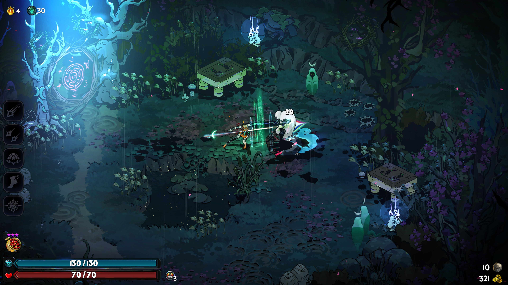

# Hidden Health bars

Hides all enemy health bars.

You can use the config file in your mod manager to also hide boss health bars by setting `hideBossHealthbars` to `true`.
Alternatively, you can also set `hideEnemyHealthbars` to `false` to show enemy health bars again, in case you want to only hide boss health bars.

